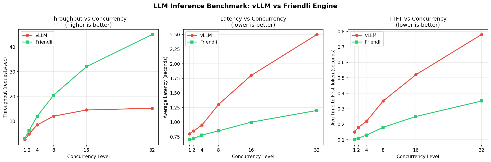

# Q3: LLM Inference Benchmark

A benchmarking tool to compare inference performance between vLLM and Friendli Engine.

---

## Quick Start

### 1. Install Dependencies

```bash
pip install -r requirements.txt
```

### 2. Configure Endpoints

Edit `config.py` to match your deployment:

```python
VLLM_ENDPOINT = "http://localhost:8000/v1/chat/completions"
FRIENDLI_ENDPOINT = "http://localhost:8001/v1/chat/completions"
MODEL_NAME = "meta-llama/Llama-3.1-8B-Instruct"
```

### 3. Run the Benchmark

```bash
python benchmark.py
```

### 4. View Results

The benchmark generates `benchmark_results.png` with comparison charts.

---

## Sample Output

Since we don't have actual vLLM and Friendli Engine deployments available, below is a sample visualization generated with mock data to demonstrate the output format:



The actual benchmark would produce similar charts with real performance data from your deployed engines.

---

## Solution Approach

### Step 1: Identifying Key Metrics

For LLM inference efficiency, we identified three critical metrics:

**Throughput (requests/second)**
- Measures system capacity
- Directly impacts cost — higher throughput = more users served per GPU dollar

**Latency (seconds)**
- Measures end-to-end response time
- Impacts user experience — lower is better

**Time to First Token (TTFT)**
- Measures perceived responsiveness in streaming applications
- Critical for chat interfaces where users expect immediate feedback

### Step 2: Designing for Fairness

A benchmark is only useful if it's fair. We ensured fairness by:

1. **Same model on both engines** — configured in `config.py`
2. **Same generation parameters** — max_tokens, temperature, top_p identical
3. **Same test prompts** — randomly selected from a shared pool
4. **Warmup phase** — discards first N requests to eliminate cold-start effects
5. **Sequential testing** — engines tested one at a time to avoid resource contention

### Step 3: Testing Under Load

We test at multiple concurrency levels `[1, 2, 4, 8, 16, 32]` to reveal:
- How each engine performs under light load (1-4 concurrent requests)
- How each engine scales under moderate load (8-16)
- How each engine handles stress conditions (32+)

This shows the full scaling behavior, not just a single data point.

### Step 4: Visualization Design

We chose a line chart with concurrency on the X-axis because:
- Shows how performance changes under increasing load
- Reveals at what point engines start to diverge
- Makes scaling characteristics immediately visible

Three subplots in one figure provide:
- Complete picture at a glance
- Easy comparison across all metrics
- Single image to share/present

---

## How Engine Switching Works

The benchmark uses a generic design where the same measurement code runs for both engines:

```python
# In benchmark.py
vllm_results = await benchmark_engine(endpoint=VLLM_ENDPOINT)
friendli_results = await benchmark_engine(endpoint=FRIENDLI_ENDPOINT)
```

The `endpoint` parameter is passed through to the metrics collection:

```python
# In metrics.py
async def send_single_request(endpoint: str, ...):
    async with session.post(endpoint, json=payload) as response:
        # Same measurement code for any engine
```

This ensures:
- **Fair comparison** — identical measurement logic
- **Easy extensibility** — add a third engine by adding one endpoint
- **No code duplication** — single function handles any OpenAI-compatible API

---

## Metrics Selected

### 1. Throughput (requests/second)

**What it measures:** How many requests the engine can handle per second at a given concurrency level.

**Why it matters:** Directly relates to cost efficiency. Higher throughput means:
- Serve more users with the same hardware
- Lower cost per request
- Better resource utilization

### 2. Latency (seconds)

**What it measures:** Total time from sending a request to receiving the complete response.

**Why it matters:** User experience metric. Lower latency means:
- Faster response times
- Better interactive experience
- Meeting SLA requirements

### 3. Time to First Token (TTFT)

**What it measures:** Time from sending a request to receiving the first token of the response.

**Why it matters:** Perceived responsiveness in streaming applications. Low TTFT means:
- User sees immediate feedback
- Application feels responsive
- Critical for chat interfaces

---

## Why This Visualization Works

### Line Chart Choice

A line chart with concurrency on the X-axis effectively shows:
- Performance trends as load increases
- The point where engines start to diverge
- Scaling characteristics (linear vs plateau)

### Color Coding

- Red for vLLM, Green for Friendli
- Instant visual comparison
- Green = "go" subconsciously suggests the better choice

### Subplot Labels

Each subplot includes "(higher is better)" or "(lower is better)" so readers immediately understand which direction represents superior performance.

### Single Figure

All three metrics in one image allows:
- Complete story at a glance
- Easy correlation across metrics
- Single file to share with stakeholders

---

## File Structure

```
q3_benchmark/
├── benchmark.py       # Main entry point — orchestrates the benchmark
├── config.py          # Configuration — endpoints, parameters, prompts
├── metrics.py         # Metric collection — async requests, timing, aggregation
├── visualize.py       # Chart generation — matplotlib plotting
├── requirements.txt   # Python dependencies
├── sample_output.png  # Sample visualization with mock data
└── README.md          # This file
```

---

## Customization

### Adjust Concurrency Levels

```python
# In config.py
CONCURRENCY_LEVELS = [1, 2, 4, 8, 16, 32, 64]  # Add higher levels for stress testing
```

### Increase Statistical Significance

```python
# In config.py
REQUESTS_PER_LEVEL = 50  # More requests = more stable averages
```

### Add Custom Prompts

```python
# In config.py
TEST_PROMPTS = [
    "Your domain-specific prompt 1...",
    "Your domain-specific prompt 2...",
]
```

### Add a Third Engine

```python
# In config.py
THIRD_ENGINE_ENDPOINT = "http://localhost:8002/v1/chat/completions"

# In benchmark.py, add:
third_results = await benchmark_engine(
    name="Third Engine",
    endpoint=THIRD_ENGINE_ENDPOINT,
    ...
)
```

---

## Assumptions

1. Both engines are already deployed and accessible via HTTP
2. Both engines serve the same model with identical weights
3. Both engines expose OpenAI-compatible `/v1/chat/completions` API
4. Engines are running on equivalent hardware (same GPU, CPU, RAM)
5. No other significant workloads are running during the benchmark

---

## Author

Shashank V Baratwaj
